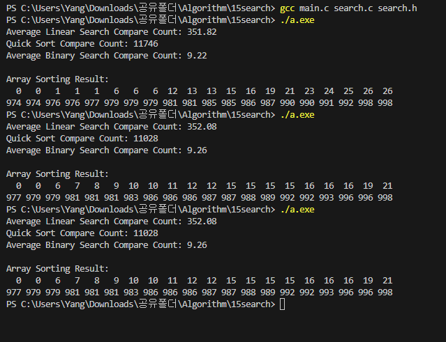

#Search Compare  {Result Image}

*선형탐색은 항상 절반씩 탐색 범위를 줄여나가기 때문에 비교횟수는 로그 스케일로 감소하나, 순차 탐색은 배열의 처음부터 끝까지 하나씩 비교하여 최악의 경우 O(n) 복잡도
for(사이즈 만큼 반복) {                                                             while(숫자가 남아있으면) {
      (비교횟수 증가)                                                               if(키 찾음)  (비교횟수 증가)
     if(키==) 루프 종료                                                             else if(키가 중간보다 크면)  (왼쪽 절반 날린후 비교횟수 증가)
}                                                                                  else(키가 중간보다 작으면)   (오른쪽 절반 날린후 비교횟수 증가)
                                                                                  }

