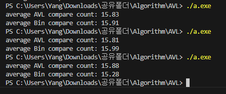

#AVL tree  {Result Image}

사진에서는 두 방식의 성능 차이가 크지 않았지만, 좀더 많은 실행결과를 분석해보면 AVL 트리 탐색은 거의 +-0.4 정도의 작은 변동을 보인반면 이진탐색은 그보다 더 큰 변동폭을 가지는 것으로 보임.
이진 탐색 트리는 균형을 유지하는 부분엔 신경을 쓰지않는 알고리즘임으로 데이터가 크거나 편향되기 쉬운 데이터가 주어진다면 이 차이는 좀더 클것으로 생각됩니다.

