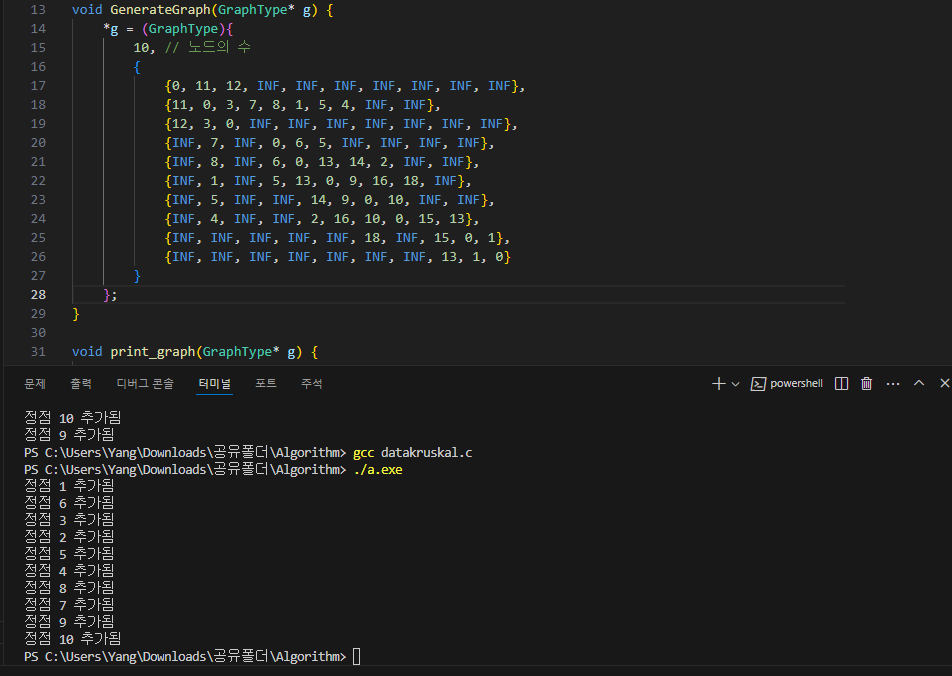

//기존의 방식대로 코드를 계속 수정해보다가 안되서, 주석에 쓴 한 블로그에서 보고 무방향 인접행렬 방식으로 수정했는데 
//급해서 올려놓고 보니 잘못된 구현인것같습니다. 
//원래는 알고리즘 강의때 구현했던 prim.c(같이 올림)에서 뼈대만 빼서 크루스칼 코드에 이식하려고했는데, 실패했습니다.

#Minheap Prim Algorithm {Result Image}

